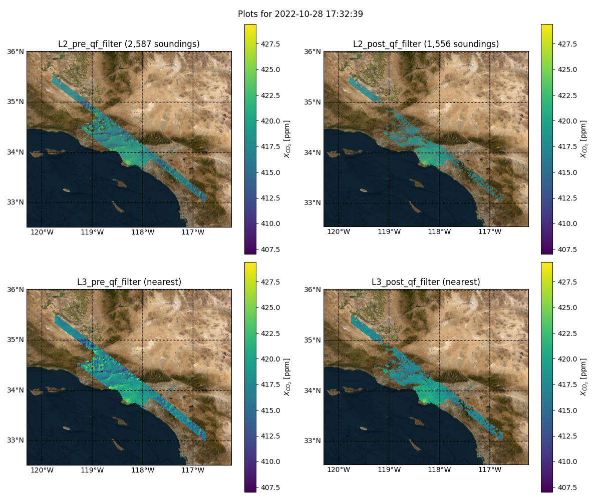

[//]: # (# OCO-3 Snapshot Area Map &#40;SAM&#41; Global, Level 3 Zarr Product Generation)

[//]: # (# Orbiting Carbon Observatories Targeted Observations: Target-focused, Level 3 Zarr + CoG Product Generation)

# Orbiting Carbon Observatory 3 Targeted Observations: Target-focused, Level 3 Zarr + CoG Product Generation

## Introduction and Description

### OCO-3

NASA-JPL's OCO-3 is an instrument onboard the International Space Station that measures carbon dioxide in the Earth's 
atmosphere. OCO-3 is similar in design to OCO-2 with the addition of the Pointing Mirror Assembly 
(PMA) which essentially allows the instrument to focus its observations on the area surrounding a given location of 
interest on a single overflight. This is a fourth operation mode (along with the three operation modes of OCO-2) called 
Snapshot Area Mapping, or SAM, and is, along with target-mode observations, the focus of this product. [This video](https://youtu.be/CwSJIsUqyIA?si=C0PMB7U2Eywmqk4W)
demonstrates the PMA and SAM-mode operation.

<p align="center">
    
    <br>
    Example SAM capture.
</p>

This software takes daily OCO-3 CO2 input, isolates SAM- and target-mode captures, and fits the data to localized, fixed 
grids for a collection of level 3 output products.

[Learn more about OCO-3](https://ocov3.jpl.nasa.gov/)

### OCO-2

**NOTE: Currently, while OCO-2 data is supported for target-focused mode product generation, some of the required data (the list of target definitions), has
not yet been verified as OK to publish, thus only limited data can be produced in target-focused mode at this time for those sites which have been confirmed to 
be publicly available. (See [OCO-2 Validation](https://ocov2.jpl.nasa.gov/science/validation/) and [Wunch et al. (2017)](https://doi.org/10.5194/amt-10-2209-2017)).**

**[See the global product README](README-Global.md) for the global-mode product which supports all data from both OCO-2 and OCO-3 simultaneously**

NASA-JPL's OCO-2 (Orbiting Carbon Observatory 2) is an Earth satellite mission to study the sources and sinks of carbon 
dioxide globally. The satellite retrieves column-averaged CO2 dry air mole fraction (XCO2) by measuring the spectra of 
reflected sunlight from the Earth's surface. OCO-2 operates in one of three modes: nadir, glint, and target. Nadir mode
effectively means "straight down," observing the ground track of the spacecraft; it provides high spatial resolution, 
but may not have enough signal-to-noise ratio over the oceans. Glint mode focuses on the bright "glint" spot where solar
radiation is reflected specularly from the surface; this can provide much higher SNR over the oceans. Usually, OCO-2 
alternates between nadir and glint modes, but the focus of this product is on target mode. Target mode makes observations
focused on a single location on the surface as the satellite passes by, allowing for more highly detailed sampling of 
areas of particular interest. This can be beneficial for calibration and validation, systematic and random error correction,
or monitoring areas of particular scientific interest. [This animation](https://ocov2.jpl.nasa.gov/media/documents/targetmode.mp4)
demonstrates OCO-2 in target mode.

[Learn more about OCO-2](https://ocov2.jpl.nasa.gov/)

### SIF

OCO-2 and OCO-3 data can also be processed to measure solar-induced florescence (SIF). This data can also be utilized in this software.

### Source Data

The software was designed to take as input NetCDF files from the [`OCO3_L2_Lite_FP v10.4r`](https://disc.gsfc.nasa.gov/datasets/OCO3_L2_Lite_FP_10.4r/summary?keywords=oco3), 
[`OCO2_L2_Lite_FP v11.1r`](https://disc.gsfc.nasa.gov/datasets/OCO2_L2_Lite_FP_11.1r/summary?keywords=OCO2_L2_Lite_FP_11.1r), and [`OCO3_L2_Lite_SIF`](https://disc.gsfc.nasa.gov/datasets/OCO3_L2_Lite_SIF_10r/summary?keywords=oco3) datasets from the [GES DISC](https://disc.gsfc.nasa.gov/) DAAC.

### What is Zarr & Why Produce it?

[Zarr](https://zarr.dev/) is a novel, cloud-optimized format "for storage of large N-dimensional typed arrays, &lbrack;stored&rbrack; 
using distributed systems like cloud object stores, and &lbrack;enabling&rbrack; efficient I/O for parallel computing 
applications."

Zarr and other formats such as Cloud-Optimized GeoTIFF are currently being investigated by NASA EOSDIS as an alternative to
traditional formats such as NetCDF.

<p align="center">
    
    <br>
    Example of pre- and post-qf data before and after processing.
</p>


Zarr support is being developed for analysis tools like [Apache SDAP](https://sdap.apache.org/), a build with this dataset can be found 
[here](https://ideas-digitaltwin.jpl.nasa.gov/) (dataset name: `oco3_sams_l3_post_qf`) 
[[Sample notebook](https://github.com/EarthDigitalTwin/FireAlarm-notebooks/blob/main/AirQuality_Demo.ipynb)].

### What is CoG & Why Produce it?

Section TBA

### Process Description

<p align="center">
    
    <br>
    Simplified process diagram.
</p>


In parallel:
1. Input NetCDF file is opened
2. Data is split into individual runs of SAM and/or Target observations (`/Sounding/operation_mode in {2,4}`), also splitting by the `target_id` variable. The end result is a collection of all SAM/Target captures in the source file, separated by target
3. Invalid/missing target IDs are dropped
4. The following steps are run on the filtered data for each SAM/Target region that both has and has not been filtered by the quality flag:
   1. A lat/lon grid is produced from a bounding box determined from a config file with the target ID and a grid resolution defined in the run configuration 
   2. Desired science variables are interpolated to fit to the lat/lon grid
   3. Output gridded arrays are masked to only include pixels that intersect with the actual source SAM footprints

Once all input files have been processed:
5. Processed datasets are concatenated and sorted into a singe, multi-day dataset for each target present in the source data
6. Datasets are output to the configured location, appending if something already exists there
7. If data was appended, check the output to ensure the time coordinate is correct (no repeated days, ascending monotonically), correcting and rewriting if necessary
8. Done! Get the next input message or exit.

<p align="center">
    
    <br>
    More detailed process diagram.
</p>


## Development

To run locally, Python and Conda should be installed. It's recommended to also have Docker installed.

### Build & Install Locally

First you must configure the Conda environment.

From the root directory of this repo:

```shell
conda create -n oco3-zarr -c conda-forge --file conda-requirements.txt
conda activate oco3-zarr
```

Then run

```shell
pip install .
```

### Runtime Configuration

The conversion script is controlled by a configuration YAML file, a template of which can be found [here](sample-sam-config.yml).

#### Inputs Section

The `input` key is required to define what and were the script sources its data from. There are two options for input; one and only one should be defined.

The first is defined by `inputs.files` which should be a list of either paths to files on the local filesystem or objects in S3.

By default, local paths or S3 objects in the `inputs.files` list will be processed as OCO-3 files, with the corresponding
OCO-2 variables being empty in the output product for the corresponding day. To specify OCO-2 files, the paths/objects 
should be specified as a dictionary with `oco2` and `oco3` as the keys - OCO-3 SIF data should use `oco3_sif`. If no 
granule for one of the source datasets exists for the day, a null value could be used or the key omitted. NOTE: It is 
up to the user to ensure the files correspond to the same day.

Example (OCO-2 & OCO-3 (+ SIF))

```yaml
input:
  files:
      # Local inputs with all datasets
    - oco2: /tmp/oco2/oco2_LtCO2_191012_B11100Ar_230603005524s.nc4
      oco3: /tmp/oco3/oco3_LtCO2_191012_B10400Br_220317234818s.nc4
      oco3_sif: /tmp/oco3/oco3_LtSIF_191012_B10309r_211129210717s.nc4
      # Local inputs with just one dataset
    - oco2: /tmp/oco2/oco2_LtCO2_150211_B11100Ar_230524225123s.nc4
      oco3: ~
      # Local inputs with just one dataset (Alternate)
    - oco2: /tmp/oco2/oco2_LtCO2_150211_B11100Ar_230524225123s.nc4
      # S3 inputs with all datasets
    - oco2: 
        path: s3://example-bucket/oco2_LtCO2_191012_B11100Ar_230603005524s.nc4
        accessKeyID: <secret>
        secretAccessKey: <secret>
      oco3: 
        path: s3://example-bucket/oco3_LtCO2_191012_B10400Br_220317234818s.nc4
        accessKeyID: <secret>
        secretAccessKey: <secret>
      oco3_sif: 
        path: s3://example-bucket/oco3_LtSIF_191012_B10309r_211129210717s.nc4
        accessKeyID: <secret>
        secretAccessKey: <secret>
      # S3 inputs with just one dataset
    - oco2: 
        path: s3://example-bucket/oco2_LtCO2_150211_B11100Ar_230524225123s.nc4
        accessKeyID: <secret>
        secretAccessKey: <secret>
      oco3: ~
      # S3 inputs with just one dataset (Alternate)
    - oco2: 
        path: s3://example-bucket/oco2_LtCO2_150211_B11100Ar_230524225123s.nc4
        accessKeyID: <secret>
        secretAccessKey: <secret>
```

Example (Default to OCO-3):

```yaml
input:
  files:
    - /tmp/oco3/oco3_LtCO2_200303_B10400Br_220318000013s.nc4
    - /tmp/oco3/oco3_LtCO2_200505_B10400Br_220318001036s.nc4
    - path: s3://bucket/key
      accessKeyID: <secret>
      secretAccessKey: <secret>
```

The S3 object can have an optional field `region` to specify the AWS region, the default value is `us-west-2`

When using this option, the script will run through the list of files and exit on completion.

The other option is to get inputs from RabbitMQ by specifying `input.queue`. 

Example:

```yaml
input:
  queue:
    host: rmq-host:5672
    port: 5672 # optional
    username: foo
    password: bar
    queue: oco3
```

This will set the script to continuously listen to the queue for messages containing input data. The input messages should be formatted as follows:

```yaml
inputs:
  - /tmp/oco3/oco3_LtCO2_200303_B10400Br_220318000013s.nc4
  - /tmp/oco3/oco3_LtCO2_200505_B10400Br_220318001036s.nc4
  - path: s3://bucket/key
    accessKeyID: <secret>
    secretAccessKey: <secret>
```

As above, the S3 object can have an optional field `region` to specify the AWS region, the default value is `us-west-2`

#### Outputs Section

The `output` key is required to define where the output data is written to, and its filename & title metadata.

To set target-focused mode, you must specify the `output.global` key as `false`

Output location can either be `output.local`, which should be a local filesystem path, or the script can be configured to write to S3 with:

```yaml
output: 
  global: false
  s3:
    url: s3://sam-zarr-bucket/root/path/
    region: us-west-2 # optional; assume us-west-2
    auth:
      accessKeyID: foo
      secretAccessKey: bar
```

```yaml
output: 
  global: false
  local: /home/user/oco-zarrs
```

The paths given in either `output.local` or `output.s3` are the root directories into which the pre- and post-qf Zarr 
groups will be placed. The parent directories for these groups are set by the following required key:

```yaml
output:
  global: false
  naming:
    pre_qf: pre_qf_root_name
    post_qf: post_qf_root_name
```

In the above example, the output Zarr groups would have the URL: `<root URL>/<dataset>/<output.naming.pre_qf>/<target ID>.zarr` or
`<root URL>/<dataset>/<output.naming.post_qf>/<target ID>.zarr` where `<dataset>` is `oco3` or `oco2`.

The metadata `title` field can be set by the optional `output.title` field:

```yaml
output:
  global: false
  title:
    pre_qf: PRE_QF_ROOT_TITLE
    post_qf: POST_QF_ROOT_TITLE
```

You can optionally also include Cloud-optimized GeoTIFF outputs by adding an `output.cog` key with its own `output.local`
or `output.s3` subkeys to configure the path:

```yaml
output:
  global: false
  cog:
    output:
      local: /home/user/oco-cogs
```

Further, you can provide options to the CoG driver as defined [here](https://gdal.org/drivers/raster/cog.html#raster-cog).
Invalid options will be ignored.

```yaml
output:
  global: false
  cog:
    output:
      local: /home/user/oco-cogs
    options:
      blocksize: 128
      overview_count: 4
```

#### Grid Resolution and Zarr Chunking Sections

Output grid size is set by the required key `grid`, with required sub-keys `latitude` and `longitude`.

The optional sub-key `method` sets the interpolation method.

If provided, `method` must be `linear`, `cubic`, or `nearest`; if omitted, `cubic`.

Example:

```yaml
grid:
  latitude: 800
  longitude: 800
  method: nearest
```

The output Zarr chunk shape can be specified by:

```yaml
chunking:
  latitude: 250
  longitude: 250
  time: 5
```

The above shape is the default if this key is omitted.

#### Target Bounding Boxes

For the target-focused product, we need to specify a fixed bounding box for each target. These are specified in a JSON file with the following format:

```
{
  target_id: {
    "name": string,
    "bbox": {
        "min_lon": float,
        "min_lat": float,
        "max_lon": float,
        "max_lat": float
    }
  },
  ...
}
```

Example:

```
{
  ...
  "fossil0005": {
    "name": "fossil_Los_Angeles_USA",
    "bbox": {
        "max_lat": 35.55349000000007,
        "max_lon": -116.74532,
        "min_lat": 32.55349000000007,
        "min_lon": -119.74532
    }
  },
  ...
  "volcano0020": {
    "name": "v223030_Nyiragongo",
    "bbox": {
        "max_lat": -0.020000000000000018,
        "max_lon": 30.75,
        "min_lat": -3.02,
        "min_lon": 27.75
    }  
  },
  ...
}
```

The path to this file must be given in the `target-file` key.

You can find a sample targets file for OCO-3 [here](targets.json). To generate your own, please see the [bounding box tools](tools/bbox-tools).

For OCO-2, an example can be found [here](targets_oco2.json), and the tools can be found [here](tools/bbox-tools/oco2).

#### Exclusions

The script will try to interpolate most of the (many) variables present in the source data. It is recommended to exclude what you don't want to process, either by:

- Excluding the group outright

```yaml
exclude-groups:
  - /Preprocessors
  - /Meteorology
```

- Excluding the individual variable

```yaml
drop-dims:
  - group: /Retrieval
    name: dp_o2a
  - group: /Retrieval
    name: dp_sco2
  - group: /Retrieval
    name: dpfrac
  - group: /Retrieval
    name: s31
  - group: /Retrieval
    name: s32
  - group: /Retrieval
    name: co2_grad_del
```

The following variables cannot be dropped:

- `/Sounding/operation_mode`
- `/Sounding/target_id`
- `/Sounding/target_name`
- All variables in the root group

For a complete list of variables, [see this document](https://web.archive.org/web/20231031164835/https://docserver.gesdisc.eosdis.nasa.gov/public/project/OCO/OCO2_OCO3_B10_DUG.pdf) (§11).

#### Additional Options

There are two additional options to configure (both optional):

- `max-workers`: Max number of concurrent threads to grid and mask data. Default: number of processors x 5.
- `mask-scaling`: Scale factor of SAM footprint polygons to mask gridded data. Range is restricted to [1, 1.5]. Default: 1 (disabled). This option was used for an older approach to data masking and is not recommended for use.

### Running Locally

To run, cd into the `sam_extract` directory (ensure the conda environment is active) and

```shell
python main.py -i <path to config yaml>
```

Command line usage:

```
usage: main.py [-h] -i YAML [--ed-user EDU] [--ed-pass EDP]

options:
  -h, --help     show this help message and exit
  -i YAML        Configuration yaml file
  --ed-user EDU  Earthdata username
  --ed-pass EDP  Earthdata password
```

### Docker Image Build & Run

From the root directory of this repo:

```shell
docker build . -t <tag>

docker run <desired docker options> -v <path to config yaml>:/oco3/run-config.yml \
       -v <path to target JSON>:/oco3/targets.json \
       -v <input granule dir>:/var/inputs \
       -v <outputs dir>:/var/outputs \
       <image> python /sam_extract/main.py -i /oco3/run-config.yml
```

**NOTE: The input, output and target JSON paths in the run config should line up with the container paths specified in the above command.**

## Deployment - Local

This script can be deployed as a cronjob by making use of the scripts in the `tools/deploy` directory.

The scripts will use [Unity SDS Data Services](https://github.com/unity-sds/unity-data-services) to search for and stage new input granules, invoke the pipeline, 
capture, zip, and upload log files to S3, and (eventually) publish a notification to AWS SNS in the event of a failure.

Base configuration can be set by exporting the following environment variables in the file `tools/deploy/run.env`.

- `SEARCH_YAML`: Granule search Docker Compose config file, if not set, use the one provided
- `DOWNLOAD_YAML`: Granule stage Docker Compose config file, if not set, use the one provided
- `PIPELINE_IMAGE`: Pipeline image to run
- `RC_TEMPLATE` : Path to template RunConfig YAML file. Use this to set various output settings
- `STATE_FILE` : Path to file which will store state information to track which data days have been processed
- `GRANULE_LIMIT`: Max number of granules to process per invocation
- `LOGGING_DIR`: Directory to place all captured log files
- `GAP_FILE`: Optional JSON file to specify known gaps in OCO-2 and OCO-3 data availability. Used to help determine whether granules on a certain date are ready to be processed or should be held to wait for other granules on that day to become available.
- `TARGET_FILE`: Path to target JSON file for OCO-3
- `TARGET_FILE_OCO2`: Path to target JSON file for OCO-2
- `VERBOSE`: Set to enable verbose logging
- `SKIP` : Optional: comma-separated list of source datasets to skip. Datasets: oco3, oco2, oco3_sif
- `S3_PATH`: S3 URI path to upload logs to
- `AWS_PROFILE`: AWS profile (`~/.aws/credentials`) which should have permissions for S3 and SNS
- `SNS_ARN`: SNS topic ARN (Currently unused)

Prerequisites to run:
- [Earthdata login](https://urs.earthdata.nasa.gov/) free access to NASA EOSDIS data
  - Once set up, activated and able to download data, set the following fields in the granule stage Docker Compose config file:
    - `services.cumulus_granules_download.environment.EDL_USERNAME`: Earthdata username, either in plaintext, base64 encoded, or a path in AWS Param Store*
    - `services.cumulus_granules_download.environment.EDL_PASSWORD`: Earthdata password, either in plaintext, base64 encoded, or a path in AWS Param Store*
    - `services.cumulus_granules_download.environment.EDL_PASSWORD_TYPE`: Either `PLAIN`, `BASE64` or `PARAM_STORE`
    - NOTE: The username, password and password type fields must be consistent with each other. If using AWS param store, AWS credentials should be provided by defining `AWS_ACCESS_KEY_ID`, `AWS_SECRET_ACCESS_KEY`, `AWS_SESSION_TOKEN`, and `AWS_REGION` values as needed.
- [AWS CLI](https://docs.aws.amazon.com/cli/latest/userguide/getting-started-install.html)

Note: AWS resources are recommended but not strictly required; the scripts will print errors if not configured, but this shouldn't impact successful running of the script.

With this, simply set up a cronjob to run the script `run.sh` from the `tools/deploy` directory

Eg:

```cronexp
0 */3 * * * cd /repo/tools/deploy && /repo/tools/deploy/run.sh
```

## Deployment - AWS

See the [deployment README](/tools/deploy/README.md) for more information on how to deploy to Amazon Web Services using serverless compute resources.

## Support

Points of contact:
- Lead developer: @RKuttruff ([Riley.K.Kuttruff\@jpl.nasa.gov](mailto:Riley.K.Kuttruff@jpl.nasa.gov?subject=OCO-3%20Zarr))
- Project manager: @ngachung