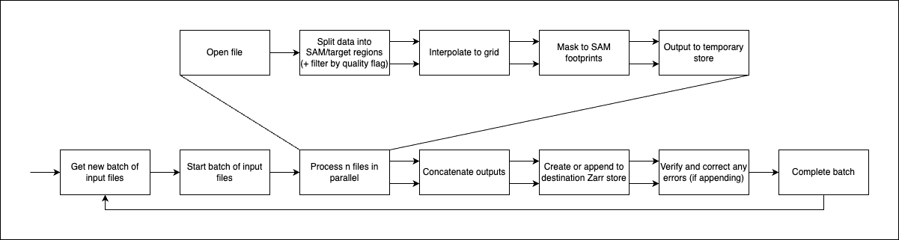

# OCO-3 Snapshot Area Map (SAM) Global, Level 3 Zarr Product Generation

## Introduction and Description

NASA-JPL's OCO-3 is an instrument onboard the International Space Station that measures carbon dioxide in the Earth's 
atmosphere. OCO-3 is similar in design to its predecessor, OCO-2, with the addition of the Pointing Mirror Assembly 
(PMA) which essentially allows the instrument to focus its observations on the area surrounding a given location of 
interest on a single overflight. This is called a Snapshot Area Map, or SAM, and is the focus of this software.

<p align="center">
    
    <br>
    Example SAM capture.
</p>

This software takes daily OCO-3 CO2 input, isolates SAM captures, and fits the data to a global, fixed grid for a level 3 output product.

### Source Data

The software was designed to take as input NetCDF files from the [`OCO3_L2_Lite_FP`](https://disc.gsfc.nasa.gov/datasets/OCO3_L2_Lite_FP_10.4r/summary?keywords=oco3) dataset from the
[GES DISC](https://disc.gsfc.nasa.gov/) DAAC.

### What is Zarr & Why Produce it?

[Zarr](https://zarr.dev/) is a novel, cloud-optimized format "for storage of large N-dimensional typed arrays, [stored] 
using distributed systems like cloud object stores, and [enabling] efficient I/O for parallel computing applications."

Zarr and other formats such as Cloud-Optimized GeoTIFF are currently being investigated by NASA EOSDIS as an alternative to
traditional formats such as NetCDF or HDF5.

<p align="center">
    
    <br>
    Example of pre- and post-qf data before and after processing.
</p>


Zarr support is being developed for analysis tools like [Apache SDAP](https://sdap.apache.org/), a build with this dataset can be found 
[here](https://ideas-digitaltwin.jpl.nasa.gov/) (dataset name: `oco3_sams_l3_post_qf`) 
[[Sample notebook](https://github.com/EarthDigitalTwin/FireAlarm-notebooks/blob/main/AirQuality_Demo.ipynb)].

### Process Description

<p align="center">
    
    <br>
    Simplified process diagram.
</p>


In parallel:
1. Input NetCDF file is opened
2. Data is filtered for SAM observations (`/Sounding/operation_mode == 4`)
3. The following steps are run on the filtered data that both has and has not been filtered by the quality flag:
   1. Desired science variables are interpolated to fit to a fixed lat/lon grid
   2. Output gridded arrays are masked to only include pixels that intersect with the actual source SAM footprints
   3. Additional arrays describing SAM target IDs and types are produced
   4. The final arrays are written to disk in a temporary directory (to save memory)

Once all input files have been processed:
4. Processed datasets are concatenated and sorted into a singe, multi-day dataset
5. Dataset is output to the configured location, appending if something already exists there
6. If data was appended, check the output to ensure the time coordinate is correct (no repeated days, ascending monotonically), correcting and rewriting if necessary
7. Done! Get the next input message or exit.

<p align="center">
    
    <br>
    More detailed process diagram. (Note: Step 3(iii) is omitted)
</p>


## Development

To run locally, Python and Conda should be installed. It's recommended to also have Docker installed.

### Build & Install Locally

First you must configure the Conda environment.

From the root directory of this repo:

```shell
conda create -n oco3-zarr -c conda-forge --file conda-requirements.txt
conda activate oco3-zarr
```

Then run

```shell
pip install .
```

### Runtime Configuration

The conversion script is controlled by a configuration YAML file, a template of which can be found [here](sample-sam-config.yml).

#### Inputs Section

The `input` key is required to define what and were the script sources its data from. There are two options for input; one and only one should be defined.

The first is defined by `inputs.files` which should be a list of either paths to files on the local filesystem or objects in S3.

Example:

```yaml
input:
  files:
    - /tmp/oco3/oco3_LtCO2_200303_B10400Br_220318000013s.nc4
    - /tmp/oco3/oco3_LtCO2_200505_B10400Br_220318001036s.nc4
    - path: s3://bucket/key
      accessKeyID: <secret>
      secretAccessKey: <secret>
```

The S3 object can have an optional field `region` to specify the AWS region, the default value is `us-west-2`

When using this option, the script will run through the list of files and exit on completion.

The other option is to get inputs from RabbitMQ by specifying `input.queue`. 

Example:

```yaml
input:
  queue:
    host: rmq-host:5672
    port: 5672 # optional
    username: foo
    password: bar
    queue: oco3
```

This will set the script to continuously listen to the queue for messages containing input data. The input messages should be formatted as follows:

```yaml
inputs:
  - /tmp/oco3/oco3_LtCO2_200303_B10400Br_220318000013s.nc4
  - /tmp/oco3/oco3_LtCO2_200505_B10400Br_220318001036s.nc4
  - path: s3://bucket/key
    accessKeyID: <secret>
    secretAccessKey: <secret>
```

As above, the S3 object can have an optional field `region` to specify the AWS region, the default value is `us-west-2`

#### Outputs Section

The `output` key is required to define where the output data is written to, and its filename & title metadata.

Output location can either be `output.local`, which should be a local filesystem path, or the script can be configured to write to S3 with:

```yaml
output: 
  s3:
    url: s3://sam-zarr-bucket/root/path/
    region: us-west-2 # optional; assume us-west-2
    auth:
      accessKeyID: foo
      secretAccessKey: bar
```

The paths given in either `output.local` or `output.s3` are the root directories into which the pre- and post-qf Zarr groups will be placed. The filenames of these groups are set by the following required key:

```yaml
output:
  naming:
    pre_qf: pre_qf_root_name.zarr
    post_qf: post_qf_root_name.zarr
```

The metadata `title` field can be set by the optional `output.title` field:

```yaml
output:
  title:
    pre_qf: PRE_QF_ROOT_TITLE
    post_qf: POST_QF_ROOT_TITLE
```

If omitted, the `title` field is derived from the corresponding value from `output.naming`, with the '`.zarr`' suffix removed.

#### Grid Resolution and Zarr Chunking Sections

Output grid size is set by the required key `grid`, with required sub-keys `latitude` and `longitude`.

The optional sub-keys `method` and `resolution_attr` set the interpolation method and `resolution` metatdata field, respectively.

If provided, `method` must be `linear`, `cubic`, or `nearest`; if omitted, `cubic`

For reference, a lon x lat size of 36,000 x 18,000 corresponds to an approximate 1km/pixel resolution.

Example:

```yaml
grid:
  latitude: 18000
  longitude: 36000
  method: linear
  resolution_attr: 1km
```

The output Zarr chunk shape can be specified by:

```yaml
chunking:
  latitude: 250
  longitude: 250
  time: 5
```

The above shape is the default if this key is omitted.

#### Exclusions

The script will try to interpolate most of the (many) variables present in the source data. It is recommended to exclude what you don't want to process, either by:

- Excluding the group outright

```yaml
exclude-groups:
  - /Preprocessors
  - /Meteorology
```

- Excluding the individual variable

```yaml
drop-dims:
  - group: /Retrieval
    name: dp_o2a
  - group: /Retrieval
    name: dp_sco2
  - group: /Retrieval
    name: dpfrac
  - group: /Retrieval
    name: s31
  - group: /Retrieval
    name: s32
  - group: /Retrieval
    name: co2_grad_del
```

The following variables cannot be dropped:

- `/Sounding/operation_mode`
- `/Sounding/target_id`
- `/Sounding/target_name`
- All variables in the root group

For a complete list of variables, [see this document](https://web.archive.org/web/20231031164835/https://docserver.gesdisc.eosdis.nasa.gov/public/project/OCO/OCO2_OCO3_B10_DUG.pdf) (§11).

#### Additional Options

There are two additional options to configure (both optional):

- `max-workers`: Max number of concurrent threads to grid and mask data. Default: number of processors x 5.
- `mask-scaling`: Scale factor of SAM footprint polygons to mask gridded data. Range is restricted to [1, 1.5]. Default: 1 (disabled). This option was used for an older approach to data masking and is not recommended for use.

### Running Locally

To run, cd into the `sam_extract` directory (ensure the conda environment is active) and

```shell
python main.py -i <path to config yaml>
```

Command line usage:

```
usage: main.py [-h] -i YAML [--ed-user EDU] [--ed-pass EDP] [--skip-netrc]

options:
  -h, --help     show this help message and exit
  -i YAML        Configuration yaml file
  --ed-user EDU  Earthdata username
  --ed-pass EDP  Earthdata password
  --skip-netrc   Don't check for a .netrc file
```

### Docker Image Build & Run

From the root directory of this repo:

```shell
docker build . -t <tag>

docker run <desired docker options> -v <path to config yaml>:/oco3/run-config.yml <tag> python /sam_extract/main.py -i /oco3/run-config.yml
```

## Deployment - Local

This script can be deployed as a cronjob by making use of the scripts in the `tools/deploy` directory.

The scripts will use [Unity SDS Data Services](https://github.com/unity-sds/unity-data-services) to search for and stage new input granules, invoke the pipeline, 
capture, zip, and upload log files to S3, and (eventually) publish a notification to AWS SNS in the event of a failure.

Base configuration can be set by exporting the following environment variables in the file `tools/deploy/run.env`.

- `SEARCH_YAML`: Granule search Docker Compose config file, if not set, use the one provided
- `DOWNLOAD_YAML`: Granule stage Docker Compose config file, if not set, use the one provided
- `LOGGING_DIR`: Directory to place all captured log files
- `PIPELINE_IMAGE`: Pipeline image to run
- `VERBOSE`: Set to enable verbose logging
- `GRANULE_LIMIT`: Max number of granules to process per invocation
- `S3_PATH`: S3 URI path to upload logs to
- `AWS_PROFILE`: AWS profile (`~/.aws/credentials`) which should have permissions for S3 and SNS
- `SNS_ARN`: SNS topic ARN (Currently unused)

Prerequisites to run:
- [Earthdata login](https://urs.earthdata.nasa.gov/) free access to NASA EOSDIS data
  - Once set up, activated and able to download data, set the following fields in the granule stage Docker Compose config file:
    - `services.cumulus_granules_download.environment.EDL_USERNAME`: Earthdata username, either in plaintext, base64 encoded, or a path in AWS Param Store*
    - `services.cumulus_granules_download.environment.EDL_PASSWORD`: Earthdata password, either in plaintext, base64 encoded, or a path in AWS Param Store*
    - `services.cumulus_granules_download.environment.EDL_PASSWORD_TYPE`: Either `PLAIN`, `BASE64` or `PARAM_STORE`
    - NOTE: The username, password and password type fields must be consistent with each other. If using AWS param store, AWS credentials should be provided by defining `AWS_ACCESS_KEY_ID`, `AWS_SECRET_ACCESS_KEY`, `AWS_SESSION_TOKEN`, and `AWS_REGION` values as needed.
- [AWS CLI](https://docs.aws.amazon.com/cli/latest/userguide/getting-started-install.html)

Note: AWS resources are recommended but not strictly required; the scripts will print errors if not configured, but this shouldn't impact successful running of the script.

With this, simply set up a cronjob to run the script `run.sh` from the `tools/deploy` directory

Eg:

```cronexp
0 */3 * * * cd /repo/tools/deploy && /repo/tools/deploy/run.sh
```

## Deployment - AWS

See the [deployment README](/tools/deploy/README.md) for more information on how to deploy to Amazon Web Services using serverless compute resources.

## Support

Points of contact:
- Lead developer: @RKuttruff ([Riley.K.Kuttruff\@jpl.nasa.gov](mailto:Riley.K.Kuttruff@jpl.nasa.gov?subject=OCO-3%20Zarr))
- Project manager: @ngachung