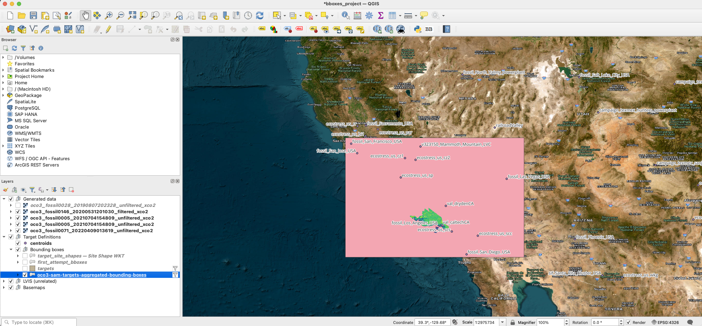
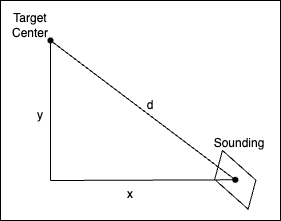
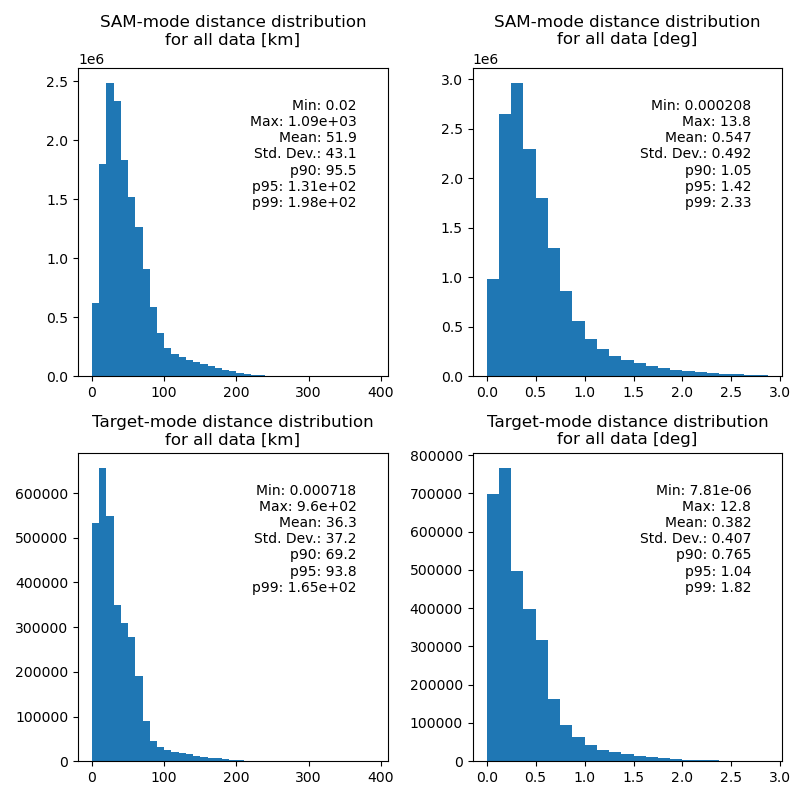
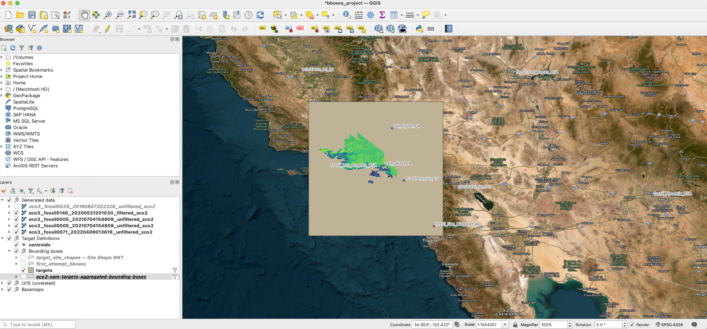

# Bounding Box Utilities

## Introduction

When generating site-specific output products, the software needs to be provided bounding boxes for each SAM-/Target-mode
target ID it will encounter. A list of target IDs and their centers can be downloaded from the [project website](https://oco3car.jpl.nasa.gov/api/report/clasp). 
There is no fixed cap on the distance a SAM- or Target-mode sounding can be made from an associated target's center, thus
these tools were created to help extract, visualize, aggregate and analyze the SAM- and Target-mode data to help the 
user decide what bounding box sizes they wish to use, evaluate its performance, and, ultimately, produce a correctly
formatted file to run the software.

## Setup

### Data

You'll need to download data from the [`OCO3_L2_Lite_FP v11r`](https://disc.gsfc.nasa.gov/datasets/OCO3_L2_Lite_FP_11r/summary) dataset. Any amount of data can be used, but we recommend
downloading as much as you are able, if not the whole dataset. You'll need an [Earthdata login](https://urs.earthdata.nasa.gov/)
to download the data.

You will also need to download the target file linked in the above section (a sample is included in this repository: 
`clasp_report.csv`, though it is not guaranteed to be current)

### Environment

Use conda (or mamba) to set up an environment to run these tools.

```shell
conda env create -f environment.yaml
conda activate oco3-bboxes
```

## The Utilities

### 1: granulesToSams.py - Extract SAM data regions over a list of granules

This tool iterates over all OCO-3 data files (granules) in a provided directory, searching for regions of SAM- or Target-mode
data and outputting them into a CSV file. It will also produce an additional file listing all the regions that will be dropped
from the final conversion as invalid or will be otherwise excluded from the analyses.

Usage:
```
usage: python granulesToSams.py [-h] -d INPUT_DIR [-o OUTPUT] [--overwrite]

options:
  -h, --help            show this help message and exit
  -d INPUT_DIR, --dir INPUT_DIR
                        Directory containing input files to process
  -o OUTPUT, --output OUTPUT
                        Output file path. Defaults to oco3-sam-bounding-boxes.csv in the current working directory.
  --overwrite           Overwrite output file if it exists.
```

### 2: samsToBounds.py - Aggregate extracted bounding boxes into encompassing bounding boxes

This tool takes the output of `granulesToSams.py` and produces a CSV file containing a bounding box for each target ID
that will encompass all the data for that ID in the files found by the `granulesToSams.py` tool.

It will also try to produce a GeoPackage of these bounds that can be viewed in a tool like [QGIS](https://www.qgis.org/).

<p align="center">
    
    <br>
    SAM over Los Angeles (fossil0005) visualized in QGIS over the aggregate bounding box for all Los Angeles data.
</p>

Usage:
```
usage: python samsToBounds.py [-h] -i INPUT [-o OUTPUT] [--overwrite] [--no-geo]

options:
  -h, --help            show this help message and exit
  -i INPUT, --input INPUT
                        Input .csv file. Should be the output of the granulesToSams.py script
  -o OUTPUT, --output OUTPUT
                        Output file path. Defaults to oco3-sam-bounding-boxes.csv in the current working directory.
  --overwrite           Overwrite output file if it exists.
  --no-geo              Do not try to produce a GeoPackage of the computed bounding boxes
```

### 3: distanceStats.py - Compute distances between soundings and target centers

This tool will iterate over all OCO-3 data files (granules) in a provided directory and extract all soundings in the 
regions found by `granulesToSams.py`. It will then compute all the distances between the sounding centers and the centers 
of their associated targets in both kilometers and degrees. 

There are two ways this tool computes distance, set by the `--diff` option: the default (`latlon`) uses the maximum difference 
in latitude or longitude (from the diagram below: $`\max (x, y)`$); (`abs`) will use the absolute distance between the sounding 
center and target center ($d$ from the diagram below).

<p align="center">
    
</p>

Usage:
```
usage: python distanceStats.py [-h] -d INPUT_DIR -s SAM_FILE -t TARGET_FILE [-o OUTPUT] [--overwrite] [--diff {abs,latlon}]

options:
  -h, --help            show this help message and exit
  -d INPUT_DIR, --dir INPUT_DIR
                        Directory containing input files to process
  -s SAM_FILE, --sams SAM_FILE
                        Path to file containing SAM and Target captures (generated by granulesToSams.py)
  -t TARGET_FILE, --targets TARGET_FILE
                        Path to file containing target definitions. Expected format: clasp_report.csv (https://oco3car.jpl.nasa.gov/api/report/clasp)
  -o OUTPUT, --output OUTPUT
                        Output file path. Defaults to oco3-sam-distances.json in the current working directory.
  --overwrite           Overwrite output file if it exists.
  --diff {abs,latlon}   Method to compute differences between sounding and target centroid. latlon (default) is the max abs difference in lat and lon (max(|lon_c - lon_s|, |lat_c - lat_s|). abs is the absolute distance between the centroids.

```

### 4: stats.ipynb - Compute and plot statistics on sounding-center distances

This is a Jupyter notebook that will load the distance data produced by `distanceStats.py` and produce histograms of each
target ID for SAM- and Target-mode distances from center. It will also include statistics like maxima and minima, mean, 
standard deviation, and 90thm 95th and 99th percentiles. It can also aggregate by target type and further to all data.

<p align="center">
    
    <br>
    Sample plot: all data
</p>

To run, simply start Jupyter and navigate to the notebook.

### 5: targetsToJson.py - Produce target configs based on offsets from target centers

Once you've decided what dimensions you want for your bounding boxes, you can use this tool to produce the config JSON
file. This tool currently produces bounding boxes from the centers given in the CSV file linked in the introduction and adds
a user-provided offset in either degrees or kilometers in all four directions. Like `samsToBounds.py`, this will also try
to produce a GeoPackage for visualization.

<p align="center">
    
    <br>
    SAM over Los Angeles (fossil0005) visualized in QGIS over a sample 3x3 deg (<code>1.5 --unit deg</code>>) bounding box for all Los Angeles data.
</p>

Usage:
```
usage: python targetsToJson.py target_file offset [-h] [--unit {km,deg}] [-o OUTPUT] [--overwrite] [--no-geo]

positional arguments:
  target_file           Path to file containing target definitions. Expected format: clasp_report.csv (https://oco3car.jpl.nasa.gov/api/report/clasp)
  offset                Offset from centroid for bboxes. Must be > 0.

options:
  -h, --help            show this help message and exit
  --unit {km,deg}       Units of the value of --offset. Boxes are computed by target centroid +/- offset in --units
  -o OUTPUT, --output OUTPUT
                        Output file path. Defaults to targets.json in the current working directory.
  --overwrite           Overwrite output file if it exists.
  --no-geo              Do not try to produce a GeoPackage of the computed bounding boxes
```

### 6: targetsStats.py - Evaluate performance of target config over a list of granules

This tool will iterate over all OCO-3 data files (granules) in a provided directory and extract all soundings in the 
regions found by `granulesToSams.py`. It will then compute how many of those soundings lie fully within, partially within,
or completely outside the provided target configuration (as produced by `targetsToJson.py`). By default, this will produce
an Excel spreadsheet of the data, with additional sheets aggregating the data by target ID and target type with an additional
aggregation for all data. The user can alternatively specify a `.csv` output, in which case the per-granule, per-Sam/Target-region
data is written alone in CSV format.

Usage:
```
usage: python targetsStats.py [-h] -d INPUT_DIR -s SAM_FILE -t TARGET_FILE [-o OUTPUT] [--overwrite]

options:
  -h, --help            show this help message and exit
  -d INPUT_DIR, --dir INPUT_DIR
                        Directory containing input files to process
  -s SAM_FILE, --sams SAM_FILE
                        Path to file containing SAM and Target captures (generated by granulesToSams.py)
  -t TARGET_FILE, --targets TARGET_FILE
                        Target bbox JSON file (generated by targetsToJson.py)
  -o OUTPUT, --output OUTPUT
                        Output file path. Defaults to oco3-target-stats.xlsx in the current working directory. If a .csv extension is given, a CSV file will be produced.
  --overwrite           Overwrite output file if it exists.
```
