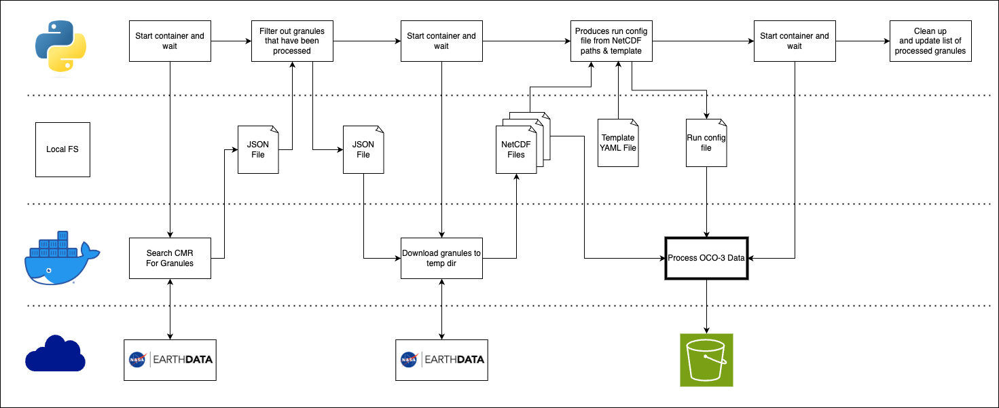
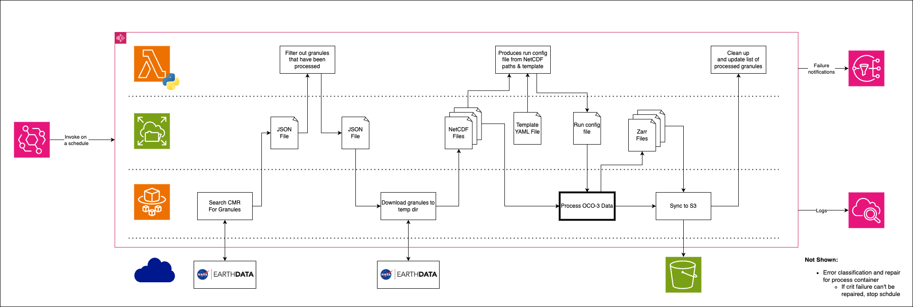
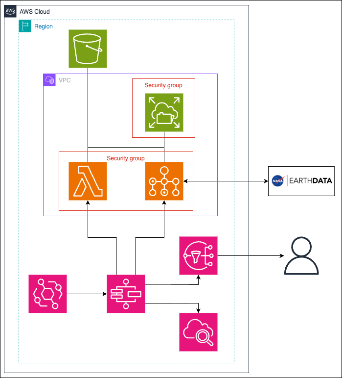
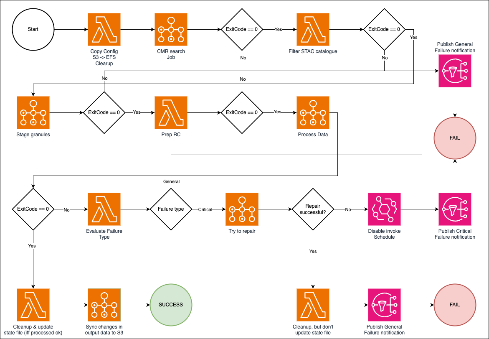

# AWS Deployment

## Architecture

We decided to utilize only serverless compute resources so that end-users would not have to worry about manually provisioning and managing resources such as EC2 instances.
In addition to needing to determine a suitable instance type for your use case, you may also be billed if you leave compute resources idling waiting for new data to process. 

The following diagram depicts the workflow that is deployed locally that we seek to translate to AWS:

<p align="center">
    
</p>

The docker containers will be run using [AWS Batch](https://aws.amazon.com/batch/) on [ECS Fargate](https://aws.amazon.com/fargate/?nc2=type_a), using [EFS](https://aws.amazon.com/efs/?nc2=h_ql_prod_st_efs) to store state and intermediate
files and [Lambda](https://aws.amazon.com/lambda/?nc2=h_ql_prod_cp_lbd) to process intermediate files, manage state, and handle error evaluation. An [AWS Step Functions](https://aws.amazon.com/step-functions/?nc2=h_ql_prod_ap_stf) state machine is used to orchestrate all the steps of the workflow, which is automatically 
triggered with an [EventBridge](https://aws.amazon.com/eventbridge/?nc2=h_ql_prod_ap_eb) schedule. Logs from the various components are aggregated into a [CloudWatch](https://aws.amazon.com/cloudwatch/?nc2=h_ql_prod_mg_cw) Log Group and
Amazon [Simple Notification Service (SNS)](https://aws.amazon.com/sns/?nc2=h_ql_prod_ap_sns) is used to notify interested users in the event of a failure.

The image used for the processing step should be tagged `>=2024.10.08` (convention is to start tags with the date of build), as that allows for detection of errors that occur during the critical phase of processing (final result write)
and subsequent restoration of result data from a backup. This prevents corruption of output data should a failure occur here. 

<p align="center">
    
    <br>
    AWS Serverless deployment workflow diagram
</p>

<p align="center">
    
    <br>
    AWS Serverless deployment service architecture diagram
</p>

## Cost Estimations

The following computation and space estimates were computed by running the workflow under several different configurations until 
each execution resulted in a minimum of input days without SAM/Target data. The final computation time and dataset size 
estimates are assuming 10 years of daily data, priced at the following `us-west-2` prices (links provided to check for 
up-to-date pricing):

- [Fargate](https://aws.amazon.com/fargate/pricing/?nc=sn&loc=3)
  - $0.04048 / vCPU / hr
  - $0.004445 / GB memory / hr
  - $0.000111 / GB ephemeral storage / hr
- [Lambda](https://aws.amazon.com/lambda/pricing/)
  - $0.0000000021 / ms @ 128 MB memory
- [EFS](https://aws.amazon.com/efs/pricing/) (Regional; Bursting throughput)
  - $0.30 / GB-Month
- [S3](https://aws.amazon.com/s3/pricing/?nc=sn&loc=4) (Standard)
  - $0.023 / GB-Month

### Global Product

The global product estimates were made for a 36,000 x 18,000 output (lon x lat) product, using linear interpolation to grid
at 32 input files per execution. For the estimate, only runs with >= 31 days of data-containing input (ie, input with 
SAM/Target data to grid) were used.

Estimates were made for the following Zarr chunking configurations (time, latitude, longitude):
- 14, 500, 500
- 1, 1000, 1000
- 31, 1000, 1000

#### Storage Usage & Cost Estimates

| Chunk Config     | Zarr Object Count | Estimated Size (MiB) | EFS Cost Est (USD/mo) | S3 Cost Est (USD/mo) |
|------------------|-------------------|----------------------|-----------------------|----------------------|
| 14 x 500 x 500   | 5,382             | 8,867.273            | $ 2.60                | $ 0.20               |
| 1 x 1000 x 1000  | 6,332             | 4,292.907            | $ 1.20                | $ 0.09               |
| 31 x 1000 x 1000 | 2,582             | 31,898.156           | $ 9.35                | $ 0.72               |

#### Compute Cost Estimates

| Chunk Config     | Estimated Compute Cost (USD) |
|------------------|------------------------------|
| 14 x 500 x 500   | $ 187.07                     |
| 1 x 1000 x 1000  | $ 96.22                      |
| 31 x 1000 x 1000 | $ 129.76                     |

### Site-Focused Product

The site-focused product estimates were made for two different resolutions each using two different interpolation methods
to grid at 365 input files per execution. Zarr chunks shapes were 14 (time) x latitude resolution x longitude resolution.
For the estimate, only runs with 365 actual day of input data were used; an initial 100 days of data were processed to 
exclude many leading days with no SAM/Target data, and the last run that matched the remaining <365 days of data was 
also excluded.

Estimates:
- 400 x 400 | Nearest-neighbor
- 400 x 400 | Linear
- 350 x 350 | Nearest-neighbor
- 350 x 350 | Cubic

#### Storage Usage & Cost Estimates

| Resolution    | Interpolation<br/>Method | Zarr Object Count | CoG File Count | Estimated Size (MiB) | EFS Cost Est (USD/mo) | S3 Cost Est (USD/mo) |
|---------------|--------------------------|-------------------|----------------|----------------------|-----------------------|----------------------|
| 400 x 400     | Nearest                  | 21,482            | 70,836         | 7,890.466            | $ 2.31                | $ 0.18               |
| 400 x 400     | Linear                   | 21,482            | 70,836         | 22,240.591           | $ 6.52                | $ 0.50               |
| 350 x 350     | Nearest                  | 21,482            | 70,836         | 6,686.883            | $ 1.96                | $ 0.15               |
| 350 x 350     | Cubic                    | 21,482            | 70,836         | 17,879.393           | $ 5.24                | $ 0.40               |


#### Compute Estimates

| Resolution | Interpolation<br/>Method | Estimated Compute Cost (USD) |
|------------|--------------------------|------------------------------|
| 400 x 400  | Nearest                  | $ 25.23                      |
| 400 x 400  | Linear                   | $ 26.98                      |
| 350 x 350  | Nearest                  | $ 23.07                      |
| 350 x 350  | Cubic                    | $ 21.05                      |

<p align="center">
    
    <br>
    Samples of the outputs of the different resolutions and interpolation methods used in these estimates. 
    In the order they appear in the above tables from top to bottom, left to right. 
    Scale: 408 to 417 ppm
</p>

## Deployment

### Before You Begin: Create manual resources

AWS deployment of this workflow is handled by Terraform, allowing for creation, deletion, or changes in configuration with simple shell commands; however, 
the Terraform code was developed in an environment with certain restrictions and, thus, assumes several key resources exist already. They will be described here
for the user to create manually. (Eventually, we hope to augment our Terraform code to handle everything)

#### S3

Create a general-purpose S3 bucket. This will hold configuration data and final output product.

#### Network & security

- VPC: Configure as desired, but allow for outbound internet traffic
- Security groups:
  - Compute SG:
    - No inbound rules
    - Outbound rule to allow all traffic
    - Alternate outbound rules:
      - All NFS traffic to EFS SG
      - All HTTP/HTTPS traffic to 0.0.0.0/0
  - EFS SG:
    - Inbound rule: All NFS traffic from Compute SG
    - No outbound rules

#### EFS Filesystem

- Type: Regional
- Encrypt at rest: Enabled
- Throughput mode: Bursting
- Performance mode: Max I/O
- Configure one mount target with desired subnet in VPC and EFS SG
- Create access points
  - POSIX User:
    - User ID: 1000
    - Group ID: 1000
  - Root directory creation permissions:
    - Owner user ID: 1000
    - Owner group ID: 1000
    - Access point permissions: 755

With the filesystem created, you must now create access points. Depending on the configuration of the deployment, you 
may need more than one, so just create all that you could need now. Each should have the following configuration:

- POSIX User:
  - User ID: 1000
  - Group ID: 1000
- Root directory creation permissions:
  - Owner user ID: 1000
  - Owner group ID: 1000
  - Access point permissions: 755

Create 3 access points in this configuration - the first for a single deployment and development and the other two for
deployments supporting data production in both global and target-focused formats. We recommend the following as their 
root directory paths:

- `/`
- `/global`
- `/target-focused`

You can choose to name the paths as you wish, but keep in mind the following:
- The latter two of these must be independent (ie, not the parent or child path of the other)
- The first access point may or may not be the parent of the other two, though it can be useful as the parent if you wish to mount to an EC2 instance to monitor the filesystem

#### IAM Roles & Policies

Note: In the following section, the values in the `Resource` column should be ARNs, with the exception of `*`. The resource-id or resource-type+resource-id pair is provided where possible, otherwise, the resource(s) refer to resources created in this section whose ARNs cannot be known ahead of time for this guide. 

##### dev role

Description: This role is used to manage and deploy the Terraform-managed resources. If you already have an administrative role/user, you can use that instead.

Custom policy `dev-policy`:

| Service               | Action                                                                                                                                                                                                                                                                                                                                                                                                             | Effect | Resource                                                                                                                       |
|-----------------------|--------------------------------------------------------------------------------------------------------------------------------------------------------------------------------------------------------------------------------------------------------------------------------------------------------------------------------------------------------------------------------------------------------------------|--------|--------------------------------------------------------------------------------------------------------------------------------|
| IAM                   | `iam:PassRole`                                                                                                                                                                                                                                                                                                                                                                                                     | Allow  | `role/task-execution-role` <br/>`role/task-role` <br/>`role/events-role` <br/>`role/lambda-execute-role` <br/>`role/step-role` |
| EventBridge Scheduler | `scheduler:GetSchedule` <br/>`scheduler:UpdateSchedule` <br/> `scheduler:CreateScehdule` <br/>`scheduler:DeleteSchedule`                                                                                                                                                                                                                                                                                           | Allow  | `schedule/default/oco3-*`                                                                                                      |
| Step Functions        | `states:*`                                                                                                                                                                                                                                                                                                                                                                                                         | Allow  | `stateMachine:oco3-*`                                                                                                          |
| Batch                 | `batch:CancelJob`<br/>`batch:CreateJobQueue`<br/>`batch:CreateSchedulingPolicy`<br/>`batch:DeleteJobQueue`<br/>`batch:DeleteSchedulingPolicy`<br/>`batch:DeregisterJobDefinition`<br/>`batch:ListTagsForResource`<br/>`batch:RegisterJobDefinition`<br/>`batch:SubmitJob`<br/>`batch:TagResource`<br/>`batch:TerminateJob`<br/>`batch:UntagResource`<br/>`batch:UpdateSchedulingPolicy`<br/>`batch:UpdateJobQueue` | Allow  | `*`                                                                                                                            |
| Lambda                | `lambda:*`                                                                                                                                                                                                                                                                                                                                                                                                         | Allow  | `*`                                                                                                                            |
| Lambda                | `lambda:CreateFunctionUrlConfig`<br/>`lambda:UpdateFunctionUrlConfig`                                                                                                                                                                                                                                                                                                                                              | Deny   | `*`                                                                                                                            |
| S3                    | `s3:GetObject`<br/>`s3:GetObjectTagging`<br/>`s3:PutObjectTagging`<br/>`s3:DeleteObjectTagging`<br/>`s3:PutObject`<br/>`s3:DeleteObject`<br/>`s3:ListBucket`<br/>`s3:PutBucketNotification`<br/>                                                                                                                                                                                                                   | Allow  | `<arn for bucket created in this section>`<br/>`<arn for bucket created in this section>/*`                                    |
| EFS                   | `elasticfilesystem:Describe*`<br/>`elasticfilesystem:Client*`                                                                                                                                                                                                                                                                                                                                                      | Allow  | `<created EFS filesystem access point arn>`                                                                                    |
| Secrets Manager       | `secretsmanager:GetSecretValue`<br/>`secretsmanager:DescribeSecret`<br/>`secretsmanager:PutSecretValue`<br/>`secretsmanager:DeleteSecret`<br/>`secretsmanager:TagResource`<br/>`secretsmanager:UntagResource`<br/>`secretsmanager:UpdateSecret`<br/>`secretsmanager:CreateSecret`<br/>`secretsmanager:RestoreSecret`<br/>`secretsmanager:ListSecretVersionIds`<br/>                                                | Allow  | `secret:oco3-*`                                                                                                                |
| SNS                   | `sns:Get*`<br/>`sns:List*`<br/>`sns:Publish`<br/>`sns:Subscribe`<br/>`sns:Unsubscribe`<br/>`sns:CreateTopic`<br/>`sns:ConfirmSubscription`<br/>`sns:TagResource`<br/>`sns:UntagResource`<br/>`sns:DeleteTopic`<br/>`sns:SetSubscriptionAttributes`<br/>`sns:SetTopicAttributes`<br/>                                                                                                                               | Allow  | `oco3-*`                                                                                                                       |
| CloudWatch Logs       | `logs:CreateLogGroup`<br/>`logs:TagResource`<br/>`logs:UnTagResource`<br/>`logs:PutRetentionPolicy`<br/>`logs:DeleteLogGroup`<br/>`logs:CreateLogStream`<br/>`logs:DeleteLogStream`<br/>`logs:DeleteRetentionPolicy`<br/>`logs:TagLogGroup`<br/>`logs:UntagLogGroup`                                                                                                                                               | Allow  | `log-group:oco3-*`                                                                                                             |
| CloudWatch            | `cloudwatch:PutMetricAlarm`<br/>`cloudwatch:DeleteAlarms`<br/>`cloudwatch:SetAlarmState`                                                                                                                                                                                                                                                                                                                           | Allow  | `alarm:oco3-*`                                                                                                                 |
| CloudWatch            | `cloudwatch:TagResource`<br/>`cloudwatch:UntagResource`                                                                                                                                                                                                                                                                                                                                                            | Allow  | `*`                                                                                                                            |

Additional policies:
- `arn:aws:iam::aws:policy/ReadOnlyAccess`

##### lambda execute role

Description: Role used by Lambda steps in the process.

Custom policy `lambda-policy`:

| Service         | Action                                                                                                                                                                                                                                                                                     | Effect | Resource                                                                                    |
|-----------------|--------------------------------------------------------------------------------------------------------------------------------------------------------------------------------------------------------------------------------------------------------------------------------------------|--------|---------------------------------------------------------------------------------------------|
| SNS             | `sns:Publish`                                                                                                                                                                                                                                                                              | Allow  | `oco3-*`                                                                                    |
| CloudWatch Logs | `logs:CreateLogDelivery`<br/>`logs:CreateLogStream`<br/>`logs:GetLogDelivery`<br/>`logs:UpdateLogDelivery`<br/>`logs:DeleteLogDelivery`<br/>`logs:ListLogDeliveries`<br/>`logs:PutLogEvents`<br/>`logs:PutResourcePolicy`<br/>`logs:DescribeResourcePolicies`<br/>`logs:DescribeLogGroups` | Allow  | `*`                                                                                         |
| CloudWatch Logs | `logs:DeleteLogStream`                                                                                                                                                                                                                                                                     | Allow  | `oco3-*:log-stream:*`                                                                       |
| EFS             | `elasticfilesystem:Describe*`<br/>`elasticfilesystem:Client*`                                                                                                                                                                                                                              | Allow  | `<created EFS filesystem access point arn>`                                                 |
| S3              | `s3:Get*`<br/>`s3:List*`<br/>`s3:Describe*`                                                                                                                                                                                                                                                | Allow  | `<arn for bucket created in this section>`<br/>`<arn for bucket created in this section>/*` |

Additional policies:

- `arn:aws:iam::aws:policy/service-role/AWSLambdaBasicExecutionRole`
- `arn:aws:iam::aws:policy/service-role/AWSLambdaVPCAccessExecutionRole`

Trust relationships:

| Effect | Principle.Service      | Action           | Condition |
|--------|------------------------|------------------|-----------|
| Allow  | `lambda.amazonaws.com` | `sts:AssumeRole` |           |

##### task role

Description: Role granting permissions to containers running in Batch jobs.

Custom policy `task-policy`:

| Service         | Action                                                                                                                                                                                                                                                                                     | Effect | Resource                                                                                    |
|-----------------|--------------------------------------------------------------------------------------------------------------------------------------------------------------------------------------------------------------------------------------------------------------------------------------------|--------|---------------------------------------------------------------------------------------------|
| CloudWatch Logs | `logs:CreateLogDelivery`<br/>`logs:CreateLogStream`<br/>`logs:GetLogDelivery`<br/>`logs:UpdateLogDelivery`<br/>`logs:DeleteLogDelivery`<br/>`logs:ListLogDeliveries`<br/>`logs:PutLogEvents`<br/>`logs:PutResourcePolicy`<br/>`logs:DescribeResourcePolicies`<br/>`logs:DescribeLogGroups` | Allow  | `*`                                                                                         |
| S3              | `s3:GetObject`<br/>`s3:PutObject`<br/>`s3:PutObjectAcl`<br/>`s3:DeleteObject`<br/>`s3:ListBucket`<br/>                                                                                                                                                                                     | Allow  | `<arn for bucket created in this section>`<br/>`<arn for bucket created in this section>/*` |
| EFS             | `elasticfilesystem:Describe*`<br/>`elasticfilesystem:Client*`                                                                                                                                                                                                                              | Allow  | `<created EFS filesystem access point arn>`                                                 |
| SNS             | `sns:Publish`                                                                                                                                                                                                                                                                              | Allow  | `oco3-*`                                                                                    |

Additional policies: N/A

Trust relationships:

| Effect | Principle.Service         | Action           | Condition                                                                                                                                                          |
|--------|---------------------------|------------------|--------------------------------------------------------------------------------------------------------------------------------------------------------------------|
| Allow  | `ecs-tasks.amazonaws.com` | `sts:AssumeRole` | `StringEquals`: `aws:SourceAccount` == `<deploy account ID>`<br/>`ArnLike`: `aws:SourceArn` ~= `arn:<partition>:ecs:<region deploying into>:<deploy account ID>:*` |

##### task-execution role

Description: Permissions for the Batch compute environment. Needs to be able to pull secrets to expose them to Batch containers.

Custom policy `task-execution-policy`:

| Service         | Action                                                                                                        | Effect | Resource        |
|-----------------|---------------------------------------------------------------------------------------------------------------|--------|-----------------|
| Secrets Manager | `secretsmanager:GetSecretValue`<br/>`secretsmanager:DescribeSecret`<br/>`secretsmanager:ListSecretVersionIds` | Allow  | `secret:oco3-*` |

Additional policies:

- `arn:aws:iam::aws:policy/service-role/AmazonECSTaskExecutionRolePolicy`

Trust relationships:

| Effect | Principle.Service         | Action           | Condition                                                                                                                                                          |
|--------|---------------------------|------------------|--------------------------------------------------------------------------------------------------------------------------------------------------------------------|
| Allow  | `ecs-tasks.amazonaws.com` | `sts:AssumeRole` | `StringEquals`: `aws:SourceAccount` == `<deploy account ID>`<br/>`ArnLike`: `aws:SourceArn` ~= `arn:<partition>:ecs:<region deploying into>:<deploy account ID>:*` |

##### step role

Description: Permissions for the step function that orchestrates all the steps in the process.

Custom policy `step-policy`:

| Service               | Action                                                                                                                                                                                                                                                                                                                                                                                                             | Effect | Resource                  |
|-----------------------|--------------------------------------------------------------------------------------------------------------------------------------------------------------------------------------------------------------------------------------------------------------------------------------------------------------------------------------------------------------------------------------------------------------------|--------|---------------------------|
| CloudWatch Logs       | `logs:CreateLogDelivery`<br/>`logs:CreateLogStream`<br/>`logs:GetLogDelivery`<br/>`logs:UpdateLogDelivery`<br/>`logs:DeleteLogDelivery`<br/>`logs:ListLogDeliveries`<br/>`logs:PutLogEvents`<br/>`logs:PutResourcePolicy`<br/>`logs:DescribeResourcePolicies`<br/>`logs:DescribeLogGroups`                                                                                                                         | Allow  | `*`                       |
| IAM                   | `iam:PassRole`                                                                                                                                                                                                                                                                                                                                                                                                     | Allow  | `role/events-role`        |
| Step Functions        | `states:ListExecutions`                                                                                                                                                                                                                                                                                                                                                                                            | Allow  | `stateMachine:oco3-*`     |
| Lambda                | `lambda:InvokeFunction`                                                                                                                                                                                                                                                                                                                                                                                            | Allow  | `function:oco3-*`         |
| SNS                   | `sns:Publish`                                                                                                                                                                                                                                                                                                                                                                                                      | Allow  | `oco3-*`                  |
| EventBridge           | `events:Put*`<br/>`events:List*`<br/>`events:Describe*`                                                                                                                                                                                                                                                                                                                                                            | Allow  |                           |
| EventBridge Scheduler | `schedule:GetSchedule`<br/>`schedule:UpdateSchedule`                                                                                                                                                                                                                                                                                                                                                               | Allow  | `schedule/default/oco3-*` |
| Batch                 | `batch:CancelJob`<br/>`batch:CreateJobQueue`<br/>`batch:CreateSchedulingPolicy`<br/>`batch:DeleteJobQueue`<br/>`batch:DeleteSchedulingPolicy`<br/>`batch:DeregisterJobDefinition`<br/>`batch:ListTagsForResource`<br/>`batch:RegisterJobDefinition`<br/>`batch:SubmitJob`<br/>`batch:TagResource`<br/>`batch:TerminateJob`<br/>`batch:UntagResource`<br/>`batch:UpdateSchedulingPolicy`<br/>`batch:UpdateJobQueue` | Allow  | `*`                       |
| CloudWatch            | `cloudwatch:DescribeAlarms`                                                                                                                                                                                                                                                                                                                                                                                        | Allow  | `alarm:oco3-*`            |

Additional policies:

- `arn:aws:iam::aws:policy/service-role/AWSLambdaBasicExecutionRole`

Trust relationships:

| Effect | Principle.Service      | Action | Condition |
|--------|------------------------|--------|-----------|
| Allow  | `states.amazonaws.com` | Allow  |           |

##### events role

Description: Permissions for the EventBridge schedule that triggers the process.

Custom policy `events-policy`:

| Service         | Action                                                                                                                                                                                                                                                                                     | Effect | Resource              |
|-----------------|--------------------------------------------------------------------------------------------------------------------------------------------------------------------------------------------------------------------------------------------------------------------------------------------|--------|-----------------------|
| CloudWatch Logs | `logs:CreateLogDelivery`<br/>`logs:CreateLogStream`<br/>`logs:GetLogDelivery`<br/>`logs:UpdateLogDelivery`<br/>`logs:DeleteLogDelivery`<br/>`logs:ListLogDeliveries`<br/>`logs:PutLogEvents`<br/>`logs:PutResourcePolicy`<br/>`logs:DescribeResourcePolicies`<br/>`logs:DescribeLogGroups` | Allow  | `*`                   |
| Step Functions  | `states:*`                                                                                                                                                                                                                                                                                 | Allow  | `stateMachine:oco3-*` |

Additional policies:

Trust relationships:

| Effect | Principle.Service                                    | Action           | Condition |
|--------|------------------------------------------------------|------------------|-----------|
| Allow  | `scheduler.amazonaws.com`<br/>`events.amazonaws.com` | `sts:AssumeRole` |           |

#### Batch Compute Environment

- Type: Fargate
- Service role: `AWSServiceRoleForBatch`
- Use Fargate Spot: `DISABLED`
- Maximum vCPUs: 
  - If you only intend to produce EITHER global OR target-focused data: 16
  - If you intend to produce both global AND target-focused data: 32
  - Alternatively, this can be left unset
- VPC: VPC being used for this deployment
- Subnets: Use the same subnet the EFS mount target was configured with
- Security groups: Compute SG

### Configuration

#### Variables

This section will cover the variables that can be used to configure both the deployment and the output product.

| Name                              | Type              | Description                                                                                                                                                                                                                                                                                      | Required? | Default                    |
|-----------------------------------|-------------------|--------------------------------------------------------------------------------------------------------------------------------------------------------------------------------------------------------------------------------------------------------------------------------------------------|-----------|----------------------------|
| `global_product`                  | Boolean           | If true, produce a global product. If false, create target-focused products.                                                                                                                                                                                                                     | Yes       |                            |
| `edl_username`                    | String            | Username for NASA Earthdata Login                                                                                                                                                                                                                                                                | Yes       |                            |
| `edl_password`                    | Secret String     | Password for NASA Earthdata Login                                                                                                                                                                                                                                                                | Yes       |                            |
| `iam_lambda_role`                 | String            | IAM role name for Lambda role created in Step 1                                                                                                                                                                                                                                                  | Yes       |                            |
| `iam_task_role`                   | String            | IAM role name for Batch job execution role created in Step 1                                                                                                                                                                                                                                     | Yes       |                            |
| `iam_task_execution_role`         | String            | IAM role name for Batch job container management role created in Step 1                                                                                                                                                                                                                          | Yes       |                            |
| `iam_step_role`                   | String            | IAM role name for Step Function state machine execution role created in Step 1                                                                                                                                                                                                                   | Yes       |                            |
| `iam_events_role`                 | String            | IAM role name for EventBridge Scheduler role created in Step 1                                                                                                                                                                                                                                   | Yes       |                            |
| `subnet`                          | String            | VPC subnet ID configured for EFS and Batch in Step 1                                                                                                                                                                                                                                             | Yes       |                            |
| `compute_sg`                      | String            | Security Group ID for Compute SG configured in Step 1                                                                                                                                                                                                                                            | Yes       |                            |
| `efs_sg`                          | String            | Security Group ID for EFS SG configured in Step 1                                                                                                                                                                                                                                                | Yes       |                            |
| `efs_fs_id`                       | String            | EFS Filesystem ID for the Filesystem created in Step 1                                                                                                                                                                                                                                           | Yes       |                            |
| `efs_ap_id`                       | String            | EFS Access Point ID for the Access Point created in Step 1                                                                                                                                                                                                                                       | Yes       |                            |
| `s3_bucket`                       | String            | Name of the S3 bucket created in Step 1                                                                                                                                                                                                                                                          | Yes       |                            |
| `s3_rc_template_key`              | String            | Key for the RC template (YAML file that holds configuration data for the data process step) object in S3                                                                                                                                                                                         | No        | `deploy/run-config.yaml`   |
| `s3_data_gap_config_key`          | String            | Key for the data gap (JSON file) object in S3                                                                                                                                                                                                                                                    | No        | `deploy/gaps.json`         |
| `s3_oco3_target_config_key`       | String            | Key for the OCO-3 target config (JSON file) object in S3                                                                                                                                                                                                                                         | No        | `deploy/targets.json`      |
| `s3_oco2_target_config_key`       | String            | Key for the OCO-2 target config (JSON file) object in S3                                                                                                                                                                                                                                         | No        | `deploy/targets_oco2.json` |
| `s3_oco3_data_gap_config_source`  | String            | Path to source data gap JSON file to copy to S3                                                                                                                                                                                                                                                  | No        | `null`                     |
| `s3_oco3_target_config_source`    | String            | Path to source target JSON file to copy to S3                                                                                                                                                                                                                                                    | Yes       |                            |
| `s3_oco2_target_config_source`    | String            | Path to source target JSON file to copy to S3                                                                                                                                                                                                                                                    | Yes       |                            |
| `s3_outputs_prefix`               | String            | Key prefix for output product objects in S3 bucket                                                                                                                                                                                                                                               | No        | `outputs`                  |
| `variables`                       | Map(List(Object)) | Variable selection. Default of null or empty map will use default variable selections. Map keys must be any number of `oco2`, `oco3`, `oco3_sif`, with their values being a list of objects with string fields `group` and `name`.                                                               | No        | `null`                     |
| `batch_ce_name`                   | String            | Name of the Batch Compute Environment provisioned in Step 1                                                                                                                                                                                                                                      | Yes       |                            |
| `log_retention_time`              | Number            | Specifies the number of days you want to retain log events in the specified log group. <br/>Possible values are: 1, 3, 5, 7, 14, 30, 60, 90, 120, 150, 180, 365, 400, 545, 731, 1096, 1827, 2192, 2557, 2922, 3288, 3653, and 0. <br/>If you select 0, the events in the log group never expire. | No        | 0                          |
| `schedule_frequency`              | String            | EventBridge schedule frequency. Valid values: `monthly`, `weekly`, `daily`, `hourly`, `half-hourly`, `quarter-hourly`, and, for backwards compatibility, `60`, `30`, `15` for minutes between invocations.                                                                                       | No        | `quarter-hourly`           |
| `output_ds_name`                  | String            | Root name of the output datasets.                                                                                                                                                                                                                                                                | Yes       |                            |
| `output_chunk_lat`                | Number            | Output Zarr chunk latitude length. Must be a positive (>0) integer.                                                                                                                                                                                                                              | Yes       |                            |
| `output_chunk_lon`                | Number            | Output Zarr chunk longitude length. Must be a positive (>0) integer.                                                                                                                                                                                                                             | Yes       |                            |
| `output_chunk_time`               | Number            | Output Zarr chunk time length. Must be a positive (>0) integer.                                                                                                                                                                                                                                  | Yes       |                            |
| `output_grid_lat_resolution`      | Number            | Size of the output dataset's latitude dimension. The longitude dimension will be set to 2x this value for global products, and equal for target-focused products. Must be an integer >= 180.                                                                                                     | No        | 18000                      |
| `output_interpolation_method`     | String            | Interpolation method used to grid output data. Must be one of "nearest" (not recommended), "linear" (recommended), or "cubic"                                                                                                                                                                    | No        | `linear`                   |
| `input_granule_limit`             | Number            | Max number of input granules to process for each execution. Must be an integer between 1 and 32 (inclusive)                                                                                                                                                                                      | Yes       |                            |
| `metrics_profile_rate`            | Number            | Number of seconds between log reports of CPU & memory utilization in the processing stage. Must be an integer between 1 and 3600 (-1 to disable).                                                                                                                                                | No        | -1                         |
| `interpolate_max_parallel_global` | Number            | Maximum number of threads that can interpolate SAM data to grid in parallel when producing a global product. Must be an integer between 1 and 4 (-1 to use process image default)                                                                                                                | No        | -1                         |
| `disable_schedule`                | Boolean           | Create the EventBridge Schedule in disabled state.                                                                                                                                                                                                                                               | No        | `false`                    |
| `skip_datasets`                   | List(string)      | List of datasets to exclude from processing. Valid values: `oco2`, `oco3`, `oco3_sif`.                                                                                                                                                                                                           | No        | `false`                    |
| `image`                           | String            | Docker image to use for data processing, sync and restore. Format: <registry>/<image_name>. Example: `rileykkjpl/oco-sam-l3`                                                                                                                                                                     | Yes       |                            |
| `image_tag`                       | String            | Docker image tag version to use for data processing, sync and restore. Format: "YYYY.MM.DD\[-\[a-z0-9-_\]+\]". Minimum version: 2024.10.08                                                                                                                                                       | Yes       |                            |
| `verbose`                         | Boolean           | Enable verbose output for the data processing step                                                                                                                                                                                                                                               | No        | `false`                    |

[//]: # (| `testing`                     | Boolean       | Is this deployment for testing? Sets a tag & adds "tftest" to created resources' names.                                                                                                                                                                                                          |           |                          |)

#### AWS Keys

Generate a key/secret pair for Terraform to use, either for the `dev` role created in step 1, or use any keys that 
will provide you with sufficient permissions.

Now set environment variables:

```shell
export AWS_ACCESS_KEY_ID=<access key id>
export AWS_SECRET_ACCESS_KEY=<secret>
```

Alternatively, configure an [AWS credentials profile](https://docs.aws.amazon.com/cli/latest/userguide/cli-configure-files.html) and,

```shell
export AWS_PROFILE=<profile name>
```

### Deploy/Update/Teardown Resources

There are two ways to deploy and manage resources depending on what you wish to do: the first deploys a single set of managed 
resources for EITHER global- OR target-focused-mode generation; the second supports SIMULTANEOUS deployments of both modes, 
but requires an added layer over the base `terraform` commands.

For either method, you must first navigate to `<repo root>/tools/deploy/terraform` and run everything from there.

Once in the terraform directory, you must first initialize the terraform environment by running

```shell
terraform init
```

#### Single-mode/Development Deployment

##### Deploy

Before deploying, we recommend you define the variables in the [configuration section](#configuration) in a file called 
`main.tfvars` formatted as follows:

```terraform
variable_name = variable_value
```

For this method of deployment, be sure to set `efs_ap_id` to the Access Point ID of the first access point created in 
[the above EFS section](#efs-filesystem).

Once ready, run

```shell
terraform apply
```

If you did not create a `main.tfvars` file (or yours is named differently), you will be prompted to enter all required 
variables. You can use `-var=<value>` to manually set individual variables or use `-var-file=<path>` to configure a 
differently named variables file.

Terraform will print a list of resources/attributes that will be created, altered or deleted and prompt you to 
continue. Type `yes` and hit enter to proceed, ctrl + C (or type something else and hit enter) to cancel.

It may take a couple of minutes, but Terraform will then automatically create all resources to your specification.

##### Change

Make any changes to your `.tfvars` file, if applicable.

```shell
terraform apply
```

Specify changes through the `.tfvars` file (`main.tfvars` will be used automatically, otherwise, specify file path 
with `-var-file`), the `-var` options, or through the prompt(s) for required variables.

Terraform will print a list of resources/attributes that will be created, altered or deleted and prompt you to 
continue. Type `yes` and hit enter to proceed, ctrl + C (or type something else and hit enter) to cancel.

##### Teardown

To delete the resources, simply run

```shell
terraform destroy
```

Terraform will print a list of all resources that will be deleted and prompt you to continue. Type `yes` and hit enter 
to proceed, ctrl + C (or type something else and hit enter) to cancel.

#### Dual-mode/Production Deployment

##### Prerequisite

Part of this method of deployment relies on checks of `.tfvars` files which requires parsing them. A parser utility is 
provided in `tfvars2json`, but is written in Golang. Before continuing, [ensure Go is installed](https://go.dev/doc/install).

##### Deploy

This method of deployment utilizes Terraform's [workspaces](https://developer.hashicorp.com/terraform/cli/workspaces)
feature to maintain separated states for each set of resources. A set of scripts has been provided to prepare and deploy
to these workspaces. 

First, run

```shell
./workspace_init.sh
```

This script will create the workspaces if they do not already exist and will create 3 `.tfvars` files: `common.tfvars`, 
which contains common configuration options such as EDL login, and identifiers for the manually-created AWS resources;
`global.tfvars`, which contains the configuration for global-mode data; and `target_focused.tfvars`, which contains
the configuration for target-focused-mode data. If these files already exist in your directory, they will be renamed
with a `.old` suffixed to their filename. 

Edit the files to set the configuration options, taking care that variable values in both `global.tfvars` and 
`target_focused.tfvars` are not equal (with the exception of `input_granule_limit`, `output_chunk_time`, 
`output_chunk_lat`, `output_chunk_lon`, `output_grid_resolution`, `schedule_frequency`, and `disable_schedule`).

For this method of deployment, be sure to set `efs_ap_id` values in `global.tfvars` and `target_focused.tfvars` to the 
Access Point IDs of the second and third access points created in [the above EFS section](#efs-filesystem).

NOTE: If a `main.tfvars` or `terraform.tfvars` or any other `.tfvars` files exist in the terraform directory, we 
recommend moving them elsewhere or changing their extension so as to avoid interfering with the terraform processes
with automatically-loaded variable definitions.

With this completed, run the pair of deploy scripts:

```shell
./deploy_global.sh
./deploy_target_focused.sh
```

These scripts will run several checks that the variables in each mode aren't colliding or that the user is deploying to 
the correct workspace and will then present the user with the Terraform plan and a prompt for confirmation.

##### Change

To alter the deployments, simply make the desired changes to the required `.tfvars` files and rerun

```shell
./deploy_global.sh
./deploy_target_focused.sh
```

If no changes will be deployed to a workspace, the corresponding script should simply exit.

##### Teardown

As with deployment, a pair of scripts are provided to tear down the resources in each workspace:

```shell
./destroy_global.sh
./destroy_target_focused.sh
```

These will display all the resources set to be deleted and prompt the user for confirmation.

NOTE: These scripts do not delete the corresponding workspaces; that will need to be done manually if so desired with 
`terraform workspace delete <workspace_name>`.

## State Machine Diagram

<p align="center">
    
</p>

## Support

Points of contact:
- Lead developer: @RKuttruff ([Riley.K.Kuttruff\@jpl.nasa.gov](mailto:Riley.K.Kuttruff@jpl.nasa.gov?subject=OCO-3%20Zarr))
- Project manager: @ngachung
