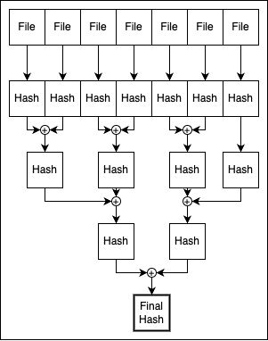

# Zarr Recursive Checksum Utility

## Description

The utility initially computes a list of MD5 hashes of all files under a provided root in either the local filesystem
or S3, which will be sorted by key. The list will then be iterated over, combining each pair of hashes as the input 
for a new MD5 hash. Odd elements at the end of the list are propagated to the next list. The final hash is obtained
when the list contains only one element.

<p align="center">
    
    <br>
    Checksum process diagram.
</p>

## To Run

To run, ensure you are using either the same conda environment that the generation code is using or set up and activate
a virtual environment with

```shell
python -m venv venv
source venv/bin/activate
pip install -r requirements.txt
```

The usage of the command is:

```
usage: checksum.py [-h] [--type {local,s3}] [-p PROFILE] [-v] path

positional arguments:
  path               Path or URL to zarr root

options:
  -h, --help         show this help message and exit
  --type {local,s3}
  -p PROFILE         AWS credentials profile
  -v                 Verbose output
```

If running against S3, ensure you have a profile configured.

### Local

```shell
python checksum.py <path_to_root>
```
### S3

```shell
python checksum.py <S3_URL_to_root> --type s3 -p <aws_profile>
```
